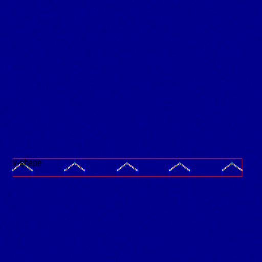
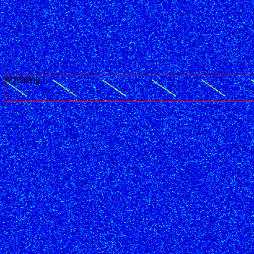
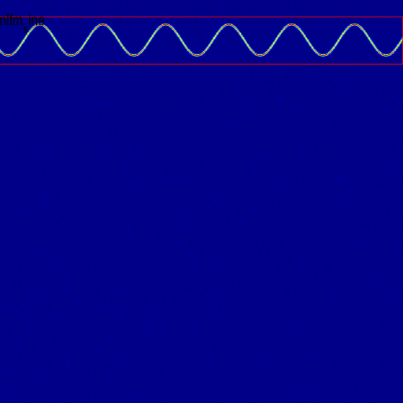
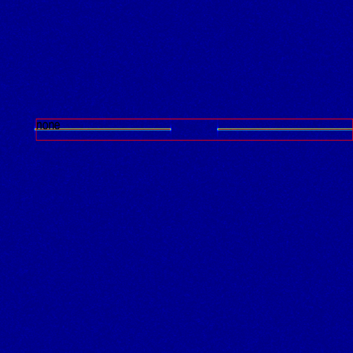
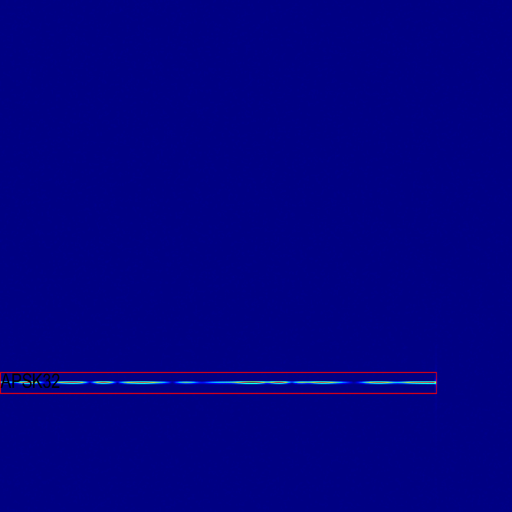
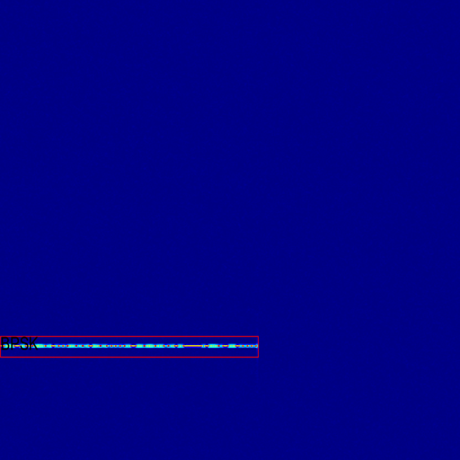
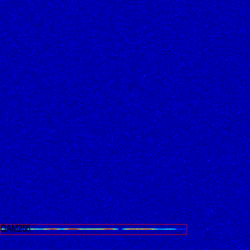
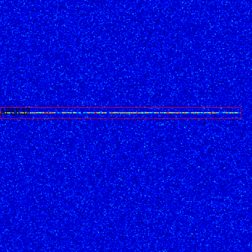
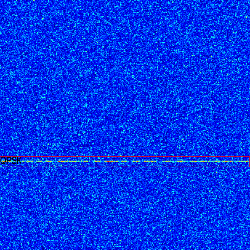
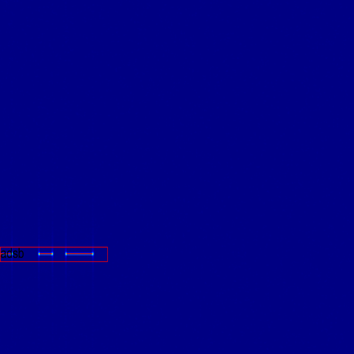

#
main file: main_gen.m

config file: keysight_signal_gen.m

使用时可能需要先安装keysight M8195任意波信号发生器的相关驱动套件，才能使用Matlab进行调用。

生成部分的样本如下

</img>
</img>
</img>
</img>
</img>

</img>
</img>
</img>
</img>
</img>
